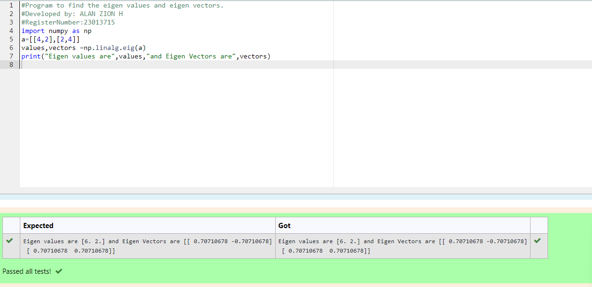

# EIGENVALUES-AND-EIGENVECTORS
## Aim:
To write a python program to find the Eigenvalues and Eigen Vectors
## Equipment’s required:
1. 	Hardware – PCs
2. 	Anaconda – Python 3.7 Installation / Moodle-Code Runner
## Algorithm:
### Step1 : Find the characteristic equation
### Step 2: Enter the values
### Step 3: Using the np.linalg.eig(),  we get two results (first is eigenvalue and second is eigenvector) of the given matrix.
### Step 4: End the Program

## Program:
```
#Program to find the eigen values and eigen vectors.
#Developed by: ALAN ZION H
#RegisterNumber:23013715
import numpy as np
a=[[4,2],[2,4]]
values,vectors =np.linalg.eig(a)
print("Eigen values are",values,"and Eigen Vectors are",vectors)

```

## Output:

## Result:
Thus the Eigenvalue and Eigenvector is successfully solved using python program
